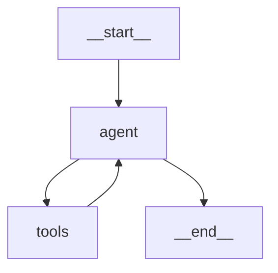

[← Nodes as Pure Functions](02-nodes-as-pure-functions.md) | [Next → MemorySaver Checkpointing](04-memorysaver-checkpointing.md)

---

# 03 — Edges and Routing

## Why Routing Exists

A linear pipeline is simple: A → B → C → END. But real agents need to decide: "Did the
last step succeed? Should I retry? Is this a billing question or a technical question?
Has the agent produced its final answer, or does it need another tool call?"

These decisions are expressed as **edges**. Unconditional edges are "always go here".
Conditional edges are "decide at runtime based on current state".

---

## Real-World Analogy

A postal sorting facility has two types of routes:

- **Fixed conveyor belts** (unconditional edges): every package from station A goes to station B without exception
- **Sort gates** (conditional edges): a scanner reads the postcode, and the gate directs
  the package to the correct regional hub — North, South, East, or West

LangGraph's `add_edge` is the fixed belt. `add_conditional_edges` is the sort gate.

---

## `add_edge` — Unconditional

```python
from langgraph.graph import StateGraph, START, END

builder = StateGraph(State)
builder.add_node("classify", classify_node)
builder.add_node("respond", respond_node)

# Always run classify before respond:
builder.add_edge(START, "classify")
builder.add_edge("classify", "respond")
builder.add_edge("respond", END)
```

---

## `add_conditional_edges` — Routing at Runtime

```python
def should_continue(state: State) -> str:
    """
    Routing function: examines state and returns the name of the next node.
    Return value MUST be one of the registered keys in the path_map.
    """
    last_message = state["messages"][-1]
    if last_message.tool_calls:
        return "execute_tools"   # model wants to call a tool
    return END                   # model produced a final answer

builder.add_conditional_edges(
    source="agent",              # which node's output triggers this routing
    path=should_continue,        # the routing function
    path_map={                   # map return values to node names (optional but recommended)
        "execute_tools": "execute_tools",
        END: END,
    },
)
```

The `path_map` is optional but strongly recommended:

- It validates that your routing function can only return registered node names
- It makes the graph visualisation accurate
- It raises an error at compile time if you typo a node name

---

## The `END` Sentinel

`END` is imported from `langgraph.graph` and signals graph termination.
Return it from a routing function (or use it as the target of `add_edge`) to stop
the run and return the final state:

```python
from langgraph.graph import END

def routing_fn(state: State) -> str:
    if state["is_complete"]:
        return END         # ← terminate
    if state["retry_count"] > 3:
        return END         # ← also terminate (max retries exhausted)
    return "retry_node"    # ← continue
```

---

## Complete Agent Graph with Conditional Routing

This is the canonical ReAct-style agent graph (tools integration):

```python
from typing import TypedDict, Annotated
import operator
from langchain_openai import ChatOpenAI
from langchain_core.messages import BaseMessage, HumanMessage
from langchain_core.tools import tool
from langgraph.graph import StateGraph, START, END
from langgraph.graph.message import add_messages

# ── State ──────────────────────────────────────────────────────────────────────
class AgentState(TypedDict):
    messages: Annotated[list[BaseMessage], add_messages]

# ── Tools ──────────────────────────────────────────────────────────────────────
@tool
def multiply(a: float, b: float) -> float:
    """Multiply two numbers. Returns the product."""
    return a * b

@tool
def get_population(country: str) -> str:
    """Get the approximate population of a country. country is a country name in English."""
    populations = {"France": "68 million", "Germany": "84 million", "Japan": "125 million"}
    return populations.get(country, "Unknown")

tools = [multiply, get_population]
tool_map = {t.name: t for t in tools}

# ── Model ──────────────────────────────────────────────────────────────────────
from langchain_core.messages import ToolMessage
import json

llm = ChatOpenAI(model="gpt-4o-mini", temperature=0)
llm_with_tools = llm.bind_tools(tools)

# ── Nodes ──────────────────────────────────────────────────────────────────────
def agent_node(state: AgentState) -> dict:
    """LLM node: reason over current messages, optionally call tools."""
    response = llm_with_tools.invoke(state["messages"])
    return {"messages": [response]}

def tool_node(state: AgentState) -> dict:
    """Execute all tool calls from the last AIMessage."""
    last_ai = state["messages"][-1]
    results = []
    for tc in last_ai.tool_calls:
        tool = tool_map.get(tc["name"])
        if tool:
            result = tool.invoke(tc["args"])
        else:
            result = json.dumps({"error": f"Unknown tool '{tc['name']}'"})
        results.append(ToolMessage(
            content=str(result),
            tool_call_id=tc["id"],
        ))
    return {"messages": results}

# ── Routing function ────────────────────────────────────────────────────────────
def should_continue(state: AgentState) -> str:
    """Route to tools if the model produced tool calls; otherwise end."""
    last = state["messages"][-1]
    if hasattr(last, "tool_calls") and last.tool_calls:
        return "tools"
    return END

# ── Graph assembly ──────────────────────────────────────────────────────────────
builder = StateGraph(AgentState)
builder.add_node("agent", agent_node)
builder.add_node("tools", tool_node)

builder.add_edge(START, "agent")
builder.add_conditional_edges("agent", should_continue, {"tools": "tools", END: END})
builder.add_edge("tools", "agent")   # loop back after tool execution

graph = builder.compile()

# ── Test ────────────────────────────────────────────────────────────────────────
result = graph.invoke({"messages": [HumanMessage("What is 47 multiplied by 83?")]})
print(result["messages"][-1].content)
# "47 multiplied by 83 is 3,901."
```

---

## Visualising the Graph with Mermaid

```python
# Print the Mermaid diagram source:
print(graph.get_graph().draw_mermaid())
```

This outputs something like:



To render as PNG (requires `langchain_core[draw]` and graphviz):

```python
img_bytes = graph.get_graph().draw_mermaid_png()
with open("agent_graph.png", "wb") as f:
    f.write(img_bytes)
```

---

## Multiple Conditional Edges from One Node

A single node can fan out to multiple possible destinations:

```python
def classify_routing(state: State) -> str:
    category = state["category"]
    routing = {
        "billing":   "billing_handler",
        "technical": "tech_handler",
        "account":   "account_handler",
    }
    return routing.get(category, "general_handler")   # default fallback

builder.add_conditional_edges(
    "classify",
    classify_routing,
    {
        "billing_handler":  "billing_handler",
        "tech_handler":     "tech_handler",
        "account_handler":  "account_handler",
        "general_handler":  "general_handler",
    },
)
```

---

## Common Pitfalls

| Pitfall                                             | Symptom                                         | Fix                                                                                  |
| --------------------------------------------------- | ----------------------------------------------- | ------------------------------------------------------------------------------------ |
| Routing function returns a string not in `path_map` | `KeyError` at runtime                           | Always define `path_map`; test routing function in isolation                         |
| Forgetting `add_edge(START, ...)`                   | `invoke()` exits immediately with empty state   | Every graph must have an edge from `START`                                           |
| Missing `END` in `path_map`                         | Graph never terminates if routing returns `END` | Include `END: END` in `path_map`                                                     |
| Circular edge without termination                   | Infinite loop; process hangs                    | Add a `max_iterations` guard in the routing function                                 |
| Complex logic in routing function                   | Hard to test; bugs are subtle                   | Keep routing functions to ≤5 lines; put complex logic in a dedicated "decision" node |

---

## Mini Summary

- `add_edge(A, B)` creates an unconditional transition: A always goes to B
- `add_conditional_edges(source, routing_fn, path_map)` routes dynamically based on current state
- The routing function receives the full state and returns a node name or `END`
- `path_map` validates return values and enables accurate graph visualisation
- `graph.get_graph().draw_mermaid()` generates a Mermaid diagram of the graph topology

---

[← Nodes as Pure Functions](02-nodes-as-pure-functions.md) | [Next → MemorySaver Checkpointing](04-memorysaver-checkpointing.md)
