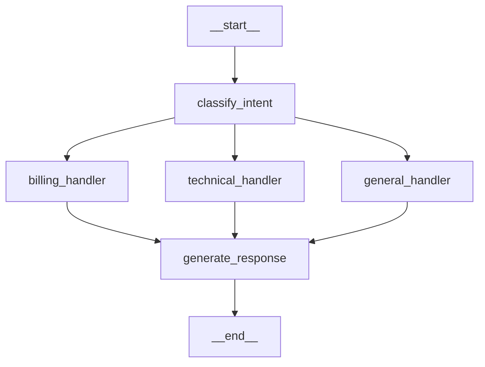

[← MemorySaver Checkpointing](04-memorysaver-checkpointing.md) | [Next Module → Multi-Step Workflows](../../module-3.4-multi-step-agent-workflows/README.md)

---

# 05 — Building a Complete Graph

## What This File Does

This file puts everything from Module 3.3 together in one annotated, runnable example.
No new concepts — only application. Read the comments; they explain every decision.

The example is a **3-node support triage system**:

1. `classify_intent` — determines the category of the user's request
2. `route_to_handler` — selects the appropriate specialist handler
3. `generate_response` — produces the final reply

With: TypedDict state, conditional edge, MemorySaver, thread_id, and graph visualisation.

---

## Real-World Analogy

A call centre triage flow:

1. IVR asks "is this billing, technical, or general?"
2. Routing system sends you to the right queue
3. Specialist answers your question

This is exactly what the graph builds.

---

## Architecture Diagram

```
        START
          │
          ▼
  ┌───────────────────┐
  │  classify_intent  │  ← LLM classifies: billing / technical / general
  └────────┬──────────┘
           │  (state["category"] is set)
           ▼
  ┌──────────────────────┐
  │  route_to_handler    │  ← Conditional edge: reads state["category"]
  └─────┬────────┬───────┘
        │        │
        ▼        ▼
  [billing_    [technical_    [general_
   handler]     handler]       handler]
        │        │               │
        └────────┴───────────────┘
                 │
                 ▼
        generate_response
                 │
                 ▼
               END
```

---

## Complete Code — Every Line Annotated

```python
# ── Imports ────────────────────────────────────────────────────────────────────
from typing import TypedDict, Annotated, Optional
import operator

from langchain_openai import ChatOpenAI
from langchain_core.messages import (
    BaseMessage,
    HumanMessage,
    SystemMessage,
    AIMessage,
)
from langgraph.graph import StateGraph, START, END
from langgraph.graph.message import add_messages   # smart reducer for message lists
from langgraph.checkpoint.memory import MemorySaver

# ── State definition ──────────────────────────────────────────────────────────
# TypedDict provides type safety; Annotated carries reducer metadata.
class TriageState(TypedDict):
    # add_messages: appends new messages; never overwrites
    messages:       Annotated[list[BaseMessage], add_messages]

    # Scalars: last-write-wins (only one node writes each field at a time)
    category:       str        # "billing" | "technical" | "general"
    confidence:     float      # 0.0–1.0 classification confidence
    handler_used:   str        # name of the handler that responded

    # operator.add: accumulates iteration count across the session
    query_count:    Annotated[int, operator.add]

    # Optional: not set on the first invocation
    final_answer:   Optional[str]

# ── Model setup ───────────────────────────────────────────────────────────────
# temperature=0 for deterministic classification; can be higher for generation
llm = ChatOpenAI(model="gpt-4o-mini", temperature=0)
llm_creative = ChatOpenAI(model="gpt-4o-mini", temperature=0.3)

# ── Node 1: classify_intent ───────────────────────────────────────────────────
# This node reads the last user message and classifies it into a category.
# It writes to: category, confidence, query_count
# It does NOT write to: messages, handler_used, final_answer
def classify_intent(state: TriageState) -> dict:
    """
    Use the LLM to classify the user's request.
    Returns the category and a rough confidence estimate.
    """
    # Read the most recent human message
    last_message = state["messages"][-1]

    classification_prompt = SystemMessage(
        content=(
            "You are a support request classifier.\n"
            "Classify the following request into exactly one of:\n"
            "  - billing: questions about invoices, payments, refunds, subscriptions\n"
            "  - technical: software issues, bugs, errors, how-to questions\n"
            "  - general: everything else\n\n"
            "Respond with JSON only, no explanation:\n"
            '{"category": "<billing|technical|general>", "confidence": <0.0-1.0>}'
        )
    )

    response = llm.invoke([classification_prompt, last_message])

    # Parse the response — handle malformed JSON gracefully
    import json
    try:
        parsed = json.loads(response.content)
        category   = parsed.get("category", "general")
        confidence = float(parsed.get("confidence", 0.7))
    except (json.JSONDecodeError, ValueError):
        category   = "general"
        confidence = 0.5

    # Return only the fields this node updates
    return {
        "category":    category,
        "confidence":  confidence,
        "query_count": 1,   # operator.add will add 1 to the current count
    }

# ── Node 2a, 2b, 2c: Specialist handler stubs ────────────────────────────────
# In production these would each have their own tools, prompts, and RAG retrievers.
# Here they each add a context message to the state for the generate_response node.

def billing_handler(state: TriageState) -> dict:
    """
    Billing specialist context injection.
    Adds a billing-specific system context to guide the final response.
    """
    context = SystemMessage(
        content=(
            "You are a billing support specialist. You have access to invoice records, "
            "subscription details, and refund policies. Be precise about amounts and dates."
        )
    )
    return {
        "messages":     [context],   # add_messages appends this; does not overwrite history
        "handler_used": "billing_handler",
    }

def technical_handler(state: TriageState) -> dict:
    """Technical support specialist context."""
    context = SystemMessage(
        content=(
            "You are a technical support engineer. Guide the user through troubleshooting "
            "step by step. Ask for error messages, OS version, and logs if relevant."
        )
    )
    return {"messages": [context], "handler_used": "technical_handler"}

def general_handler(state: TriageState) -> dict:
    """General support specialist context."""
    context = SystemMessage(
        content="You are a helpful support agent. Answer clearly and concisely.")
    return {"messages": [context], "handler_used": "general_handler"}

# ── Node 3: generate_response ─────────────────────────────────────────────────
# This node uses the full message history (including the context injected by the handler)
# to generate the final reply to the user.
def generate_response(state: TriageState) -> dict:
    """Generate the final customer-facing response."""
    # Invoke with the full message history — includes the specialist context added earlier
    response = llm_creative.invoke(state["messages"])
    return {
        "messages":     [response],
        "final_answer": response.content,
    }

# ── Routing function ──────────────────────────────────────────────────────────
# This function is called by add_conditional_edges after classify_intent runs.
# It reads state["category"] and returns the name of the next node.
def route_by_category(state: TriageState) -> str:
    """Route to the appropriate specialist based on classification."""
    routing = {
        "billing":   "billing_handler",
        "technical": "technical_handler",
        "general":   "general_handler",
    }
    # Fallback to general if category is unrecognised
    return routing.get(state["category"], "general_handler")

# ── Graph assembly ─────────────────────────────────────────────────────────────
builder = StateGraph(TriageState)

# Register all nodes:
builder.add_node("classify_intent",  classify_intent)
builder.add_node("billing_handler",  billing_handler)
builder.add_node("technical_handler",technical_handler)
builder.add_node("general_handler",  general_handler)
builder.add_node("generate_response",generate_response)

# Entry point:
builder.add_edge(START, "classify_intent")

# Conditional routing after classification:
builder.add_conditional_edges(
    "classify_intent",
    route_by_category,
    {
        "billing_handler":   "billing_handler",
        "technical_handler": "technical_handler",
        "general_handler":   "general_handler",
    },
)

# All handlers converge at generate_response:
builder.add_edge("billing_handler",   "generate_response")
builder.add_edge("technical_handler", "generate_response")
builder.add_edge("general_handler",   "generate_response")

# Exit:
builder.add_edge("generate_response", END)

# ── Compile with MemorySaver ───────────────────────────────────────────────────
# MemorySaver checkpoints state after every node; enables multi-turn sessions.
checkpointer = MemorySaver()
graph = builder.compile(checkpointer=checkpointer)

# ── Visualise ─────────────────────────────────────────────────────────────────
print(graph.get_graph().draw_mermaid())
# Expected output:
# graph TD
#   __start__ --> classify_intent
#   classify_intent --> billing_handler
#   classify_intent --> technical_handler
#   classify_intent --> general_handler
#   billing_handler --> generate_response
#   technical_handler --> generate_response
#   general_handler --> generate_response
#   generate_response --> __end__

# ── Single-turn test ──────────────────────────────────────────────────────────
config = {"configurable": {"thread_id": "test-session-001"}}

initial_state = {
    "messages":     [HumanMessage("I was charged twice for my subscription this month.")],
    "category":     "",
    "confidence":   0.0,
    "handler_used": "",
    "query_count":  0,
    "final_answer": None,
}

result = graph.invoke(initial_state, config=config)

print(f"Category:     {result['category']}")       # "billing"
print(f"Handler:      {result['handler_used']}")   # "billing_handler"
print(f"Query count:  {result['query_count']}")    # 1
print(f"Answer:       {result['final_answer'][:100]}...")

# ── Multi-turn follow-up (MemorySaver loads prior state) ──────────────────────
result2 = graph.invoke(
    {"messages": [HumanMessage("Can you also check if there's a pending refund?")]},
    config=config,   # same thread_id — LangGraph loads prior context
)
print(f"Query count:  {result2['query_count']}")   # 2 (accumulated)
print(f"Answer:       {result2['final_answer'][:100]}...")
```

---

## Visualisation Output

Running `graph.get_graph().draw_mermaid()` produces:



---

## State Snapshot After Completion

```python
snapshot = graph.get_state(config)
print(snapshot.values["category"])      # "billing"
print(snapshot.values["query_count"])   # 2 (after two turns)
print(snapshot.values["handler_used"])  # "billing_handler"
print(len(snapshot.values["messages"])) # total messages in the thread
print(snapshot.next)                    # [] — run is complete
```

---

## Common Pitfalls

| Pitfall                                    | Symptom                                         | Fix                                                                                             |
| ------------------------------------------ | ----------------------------------------------- | ----------------------------------------------------------------------------------------------- |
| Missing initial values for all State keys  | `KeyError` in nodes that read unset fields      | Provide all State fields in the initial `invoke()` call                                         |
| `query_count` always equals 1              | Counter doesn't accumulate across turns         | Use `Annotated[int, operator.add]` and return `{"query_count": 1}`                              |
| `thread_id` not passed on second turn      | Each turn starts fresh; prior context lost      | Always pass the same `config` dict to every `invoke()` in a session                             |
| Handler nodes add duplicate SystemMessages | Context injected every turn from prior sessions | In multi-turn setups, inject context only on the first turn (check `state["query_count"] == 1`) |
| Graph not visualised before deployment     | Unexpected routing discovered in production     | Always call `draw_mermaid()` after assembly to verify topology                                  |

---

## Mini Summary

- The complete triage graph uses: TypedDict State with `add_messages` + `operator.add`, three specialist handler nodes, a conditional edge routing by category, and MemorySaver for multi-turn sessions
- Initial state must provide defaults for all required TypedDict fields
- `operator.add` on integer fields accumulates across turns when the same `thread_id` is reused
- `graph.get_graph().draw_mermaid()` confirms the routing topology before deployment
- Handlers inject specialist context as `SystemMessage` into the message list; the `generate_response` node sees the full enriched history

---

[← MemorySaver Checkpointing](04-memorysaver-checkpointing.md) | [Next Module → Multi-Step Workflows](../../module-3.4-multi-step-agent-workflows/README.md)
