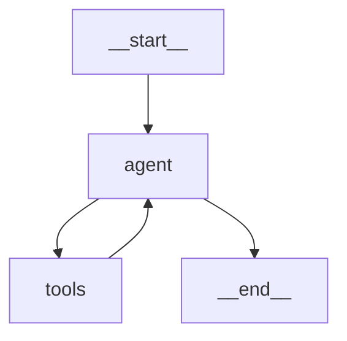

[← Module Overview](README.md) | [Next → Human-in-the-Loop](02-human-in-the-loop.md)

---

# 01 — ReAct Loop From Scratch

## Why Build It From Scratch?

LangGraph ships `create_react_agent()` — a one-liner that builds a ReAct agent.
You should still know how to build it from scratch because:

1. The shortcut hides the wiring decisions — when it breaks, you don't know why
2. Production agents always customise the loop: different retry logic, custom tool execution, streaming, cost tracking
3. Understanding the scaffold makes every DeepAgent module easier to read

Build it from scratch first. Use `create_react_agent` for prototypes.

---

## Real-World Analogy

ReAct stands for Reasoning + Acting. The pattern mirrors how an experienced consultant works:

1. **Reason:** Read the brief; what do I know, what do I need?
2. **Act:** Make a call, run a query, check a resource
3. **Observe:** Read the result; does this change my understanding?
4. **Repeat:** Until the question is answered or the brief is complete

The agent loop is the consultant. The tools are their resources. The message list is the paper trail.

---

## The Four Components of a ReAct Agent

```
┌────────────────────────────────────────────────────────────────────────────┐
│  1. State  — TypedDict with messages + iteration tracking                 │
│  2. Agent node — LLM with bound tools; adds AIMessage to state            │
│  3. Tool node — executes tool_calls; adds ToolMessages to state           │
│  4. Routing function — "continue looping?" or "done?"                     │
└────────────────────────────────────────────────────────────────────────────┘
```

---

## Complete Annotated Implementation

```python
# react_agent.py
# ─────────────────────────────────────────────────────────────────────────────
from typing import TypedDict, Annotated
import json

from langchain_openai import ChatOpenAI
from langchain_core.tools import tool, ToolException
from langchain_core.messages import (
    BaseMessage, HumanMessage, SystemMessage, AIMessage, ToolMessage
)
from langgraph.graph import StateGraph, START, END
from langgraph.graph.message import add_messages
from langgraph.checkpoint.memory import MemorySaver

# ═══════════════════════════════════════════════════════════════════
# STATE
# ═══════════════════════════════════════════════════════════════════
class ReActState(TypedDict):
    messages:         Annotated[list[BaseMessage], add_messages]
    # iteration_count is NOT accumulated across multi-turn sessions —
    # it resets with each new user query. Use operator.add if you want
    # it to accumulate. Here last-write-wins is correct.
    iteration_count:  int
    max_iterations:   int   # set once in initial state; never modified

# ═══════════════════════════════════════════════════════════════════
# TOOLS
# ═══════════════════════════════════════════════════════════════════
@tool
def search_web(query: str) -> str:
    """
    Search the web for current information.
    Returns a JSON array of {title, snippet} results.
    Use for: current events, recent data, real-time information.
    """
    # Stub — replace with real search API
    mock_results = [
        {"title": f"Result for '{query}'", "snippet": f"Relevant information about {query}."},
        {"title": f"Another source on '{query}'", "snippet": f"Additional context for {query}."},
    ]
    return json.dumps(mock_results)

@tool
def calculate(expression: str) -> str:
    """
    Evaluate a mathematical expression safely.
    expression must be a valid Python arithmetic expression using only numbers and operators.
    Examples: '17 * 84', '(12 + 8) / 4', '2 ** 10'
    Returns the result as a string.
    """
    # Security: only allow numeric expressions — no builtins or imports
    import re
    if re.search(r'[a-zA-Z_]', expression):
        raise ToolException(
            f"Expression '{expression}' contains non-numeric characters. "
            "Use only numbers and arithmetic operators (+, -, *, /, **, %)."
        )
    try:
        result = eval(expression, {"__builtins__": {}}, {})
        return str(result)
    except Exception as e:
        raise ToolException(f"Could not evaluate '{expression}': {e}")

TOOLS = [search_web, calculate]
TOOL_MAP = {t.name: t for t in TOOLS}

# ═══════════════════════════════════════════════════════════════════
# MODEL
# ═══════════════════════════════════════════════════════════════════
llm = ChatOpenAI(model="gpt-4o-mini", temperature=0)
llm_with_tools = llm.bind_tools(TOOLS)

SYSTEM_PROMPT = SystemMessage(
    content=(
        "You are a capable research assistant. "
        "Use search_web for current information and calculate for arithmetic. "
        "Think step by step before calling tools. "
        "When you have a complete answer, respond directly without calling any more tools."
    )
)

# ═══════════════════════════════════════════════════════════════════
# NODES
# ═══════════════════════════════════════════════════════════════════
def agent_node(state: ReActState) -> dict:
    """
    The REASON step: invoke the LLM with the full message history.
    The model either produces tool_calls (→ ACT) or a final answer (→ END).
    """
    # Prepend system prompt to every LLM call
    messages_with_system = [SYSTEM_PROMPT, *state["messages"]]
    response = llm_with_tools.invoke(messages_with_system)
    return {
        "messages": [response],
        "iteration_count": state["iteration_count"] + 1,  # manual increment
    }

def tool_node(state: ReActState) -> dict:
    """
    The ACT step: execute every tool call from the last AIMessage.
    Each tool result becomes a ToolMessage in the message list.
    """
    last_ai: AIMessage = state["messages"][-1]
    tool_messages = []

    for tc in last_ai.tool_calls:
        tool_fn = TOOL_MAP.get(tc["name"])
        if tool_fn is None:
            content = json.dumps({"error": f"Unknown tool '{tc['name']}'"})
        else:
            try:
                result = tool_fn.invoke(tc["args"])
                content = result if isinstance(result, str) else json.dumps(result)
            except ToolException as e:
                # Expected failure — tell the model; it may retry with corrected args
                content = json.dumps({
                    "error": str(e),
                    "hint": "Correct your arguments and retry.",
                })
            except Exception as e:
                # Unexpected failure — report without crashing
                content = json.dumps({"error": f"Unexpected: {type(e).__name__}: {e}"})

        tool_messages.append(
            ToolMessage(content=content, tool_call_id=tc["id"])
        )

    return {"messages": tool_messages}
    # NOTE: iteration_count is NOT incremented here.
    # Only the REASON step counts as an iteration.

# ═══════════════════════════════════════════════════════════════════
# ROUTING
# ═══════════════════════════════════════════════════════════════════
def should_continue(state: ReActState) -> str:
    """
    After the agent_node runs, decide:
    - If the model produced tool_calls → "tools" (ACT step)
    - If max_iterations reached → END (safety termination)
    - Otherwise → END (model answered directly)
    """
    last = state["messages"][-1]

    # Safety termination: prevent infinite loops
    if state["iteration_count"] >= state["max_iterations"]:
        return END

    # Check if the model wants to call tools
    if isinstance(last, AIMessage) and last.tool_calls:
        return "tools"

    return END

# ═══════════════════════════════════════════════════════════════════
# GRAPH ASSEMBLY
# ═══════════════════════════════════════════════════════════════════
builder = StateGraph(ReActState)

builder.add_node("agent", agent_node)
builder.add_node("tools", tool_node)

# Entry: always start with the agent
builder.add_edge(START, "agent")

# After agent: route conditionally
builder.add_conditional_edges(
    "agent",
    should_continue,
    {"tools": "tools", END: END},
)

# After tools: always loop back to agent (the OBSERVE → REASON step)
builder.add_edge("tools", "agent")

graph = builder.compile(checkpointer=MemorySaver())

# ═══════════════════════════════════════════════════════════════════
# USAGE
# ═══════════════════════════════════════════════════════════════════
def run_agent(question: str, thread_id: str = "default", max_iter: int = 10) -> str:
    """Run the ReAct agent and return the final answer."""
    config = {"configurable": {"thread_id": thread_id}}
    initial_state = {
        "messages":        [HumanMessage(question)],
        "iteration_count": 0,
        "max_iterations":  max_iter,
    }
    result = graph.invoke(initial_state, config=config)
    return result["messages"][-1].content

# Test:
answer = run_agent("What is 1234 multiplied by 5678?")
print(answer)
# "1234 multiplied by 5678 equals 7,006,652."

answer2 = run_agent("Search for recent LangGraph updates and summarise them.")
print(answer2[:200])
```

---

## Visualising the ReAct Loop

```python
print(graph.get_graph().draw_mermaid())
```



The `tools → agent` back-edge is what makes this a loop, not a chain.

---

## Tracing Through a Multi-Step Example

For the question `"What is 47 * 83?"`:

```
Iteration 1:
  agent_node receives: [HumanMessage("What is 47 * 83?")]
  LLM responds: AIMessage(tool_calls=[ToolCall(name="calculate", args={"expression":"47*83"})])
  routing: → "tools"

  tool_node receives: AIMessage with tool_calls
  calculate.invoke({"expression": "47*83"}) → "3901"
  Appends: ToolMessage(content="3901", tool_call_id="call_xyz")
  routing: → "agent" (unconditional)

Iteration 2:
  agent_node receives: [..., AIMessage(tool_calls=[...]), ToolMessage("3901")]
  LLM responds: AIMessage(content="47 × 83 = 3,901.")
  routing: no tool_calls → END

Final state["messages"][-1].content = "47 × 83 = 3,901."
```

---

## Common Pitfalls

| Pitfall                                      | Symptom                                           | Fix                                                          |
| -------------------------------------------- | ------------------------------------------------- | ------------------------------------------------------------ |
| Not resetting `iteration_count` between runs | Second question starts at iteration 8             | Set `iteration_count: 0` in every new initial state          |
| `max_iterations` too low                     | Agent gives up on legitimate multi-step tasks     | Start with 10; increase for complex research tasks           |
| Tool node increments iteration_count         | Off-by-one; tool execution counts as an iteration | Only increment in agent_node; tool_node is free              |
| No ToolException handling in tool_node       | Single tool failure crashes the whole node        | Wrap every `tool.invoke()` in try/except                     |
| System prompt not prepended                  | Model loses context about its role and tools      | Always prepend SystemMessage inside agent_node, not in State |

---

## Mini Summary

- A ReAct agent has four components: State, agent node, tool node, routing function
- The routing function checks `last.tool_calls` to decide loop vs terminate
- `tools → agent` is an unconditional back-edge — the loop's heart
- `iteration_count` + `max_iterations` is the safety valve against infinite loops
- Always wrap tool invocations in try/except in the tool node; never let a single tool failure crash the graph

---

[← Module Overview](README.md) | [Next → Human-in-the-Loop](02-human-in-the-loop.md)
