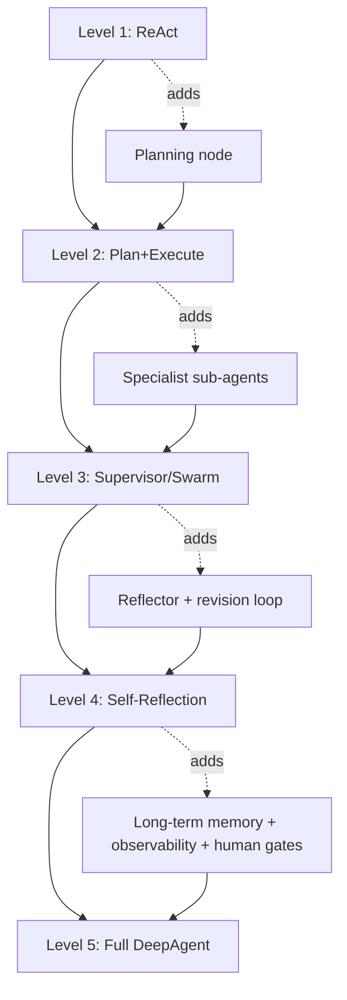

[← Module Overview](README.md) | [Next → Supervisor Pattern](02-supervisor-pattern.md)

---

# 01 — What Makes an Agent "Deep"

## The Problem with Shallow Agents

A single-node ReAct agent can answer factual questions. But give it a task like:
"Research the competitive landscape for autonomous vehicles, identify the top 5 threats,
and write a 3,000-word strategic briefing with citations" — and it will either hallucinate,
truncate, lose context, loop forever, or produce shallow output that any analyst would reject.

The failure mode is not the model's intelligence. It's the _architecture_.

---

## Real-World Analogy

The difference between a single freelancer and a consulting firm. Both can answer questions.
But for a complex deliverable — a market entry strategy — you want:

- A **partner** (Planner) who scopes the engagement and creates the work plan
- A **research team** (specialist sub-agents) who gather evidence in parallel
- A **senior analyst** (Reflector) who reviews the draft and ensures quality
- A **partner review gate** (human gate) before it goes to the client

A Level 1 agent is the freelancer. A Level 5 DeepAgent is the consulting firm.

---

## The 5-Level Progression

```
Level 1 — Single-step ReAct
  ┌────────────────────────────────────────────────────────────────┐
  │  One agent, one tool loop, one conversation.                   │
  │  Can: answer questions, run calculations, search the web.      │
  │  Can't: delegate, plan ahead, recover from failure.            │
  └────────────────────────────────────────────────────────────────┘

Level 2 — Multi-step Planning
  ┌────────────────────────────────────────────────────────────────┐
  │  Planner creates a task list. Executor works through it.       │
  │  Can: multi-step research, sequential document processing.     │
  │  Can't: delegate to specialists, self-reflect, recover.        │
  └────────────────────────────────────────────────────────────────┘

Level 3 — Delegation (Supervisor/Swarm)
  ┌────────────────────────────────────────────────────────────────┐
  │  Supervisor routes to specialist sub-agents by task type.      │
  │  Can: parallel research, domain-specific handling.             │
  │  Can't: improve its own output, recover from sub-agent failure.│
  └────────────────────────────────────────────────────────────────┘

Level 4 — Self-Reflection
  ┌────────────────────────────────────────────────────────────────┐
  │  Reflector scores output. Revision loop until quality passes.  │
  │  Can: improve its own work, detect low-quality output.         │
  │  Can't: persist knowledge between sessions, handle novel errors│
  └────────────────────────────────────────────────────────────────┘

Level 5 — Full DeepAgent
  ┌────────────────────────────────────────────────────────────────┐
  │  All of the above, plus:                                       │
  │  - Long-term memory (retrieval from past sessions)             │
  │  - Fault-tolerant recovery (retry, fallback, human escalation) │
  │  - Observability (LangSmith traces, cost/latency tracking)     │
  │  - Human-in-the-loop gates for irreversible actions            │
  │  Can: handle open-ended, multi-day, multi-actor tasks.         │
  └────────────────────────────────────────────────────────────────┘
```

---

## What "Deep" Means — Seven Defining Characteristics

### 1. Multi-step planning

A deep agent doesn't just react — it creates a plan before acting, and updates
the plan as it learns more. See Module 3.5/04 (Plan and Execute).

### 2. Persistent state

State survives node failures and process restarts. A deep agent can be interrupted
on step 6 of 10 and resume exactly where it left off. See Module 3.3/04 (MemorySaver).

### 3. Delegation

A deep agent breaks complex tasks into sub-tasks and routes them to specialists.
It doesn't try to be an expert in everything itself.

### 4. Self-reflection

A deep agent critiques its own output and revises it before delivery. Quality control
is internal, not external. See Module 3.5/05 (Reflexion).

### 5. Recovery

A deep agent has explicit fallback paths for every failure mode: tool errors,
quality below threshold, resource limits reached, human cancellation. It never
silently fails.

### 6. Long-term memory

A deep agent retrieves context from past sessions — past research findings, user
preferences, previous decisions — and uses them to avoid repeating work.

### 7. Observability

Every step is traced, every cost is logged, every failure is captured. A deep agent
produces the audit trail needed to debug, improve, and trust it.

---

## Side-by-Side Comparison: Shallow vs Deep

**Task:** "Produce a competitive analysis of the top 3 AI coding assistant products."

```
Shallow Agent (Level 1 ReAct)
─────────────────────────────────────────────────────────────────────
1. User sends task
2. Agent calls search_web("top AI coding assistants")
3. Agent calls search_web("GitHub Copilot features")
4. Agent produces a 500-word summary from search results
5. Done.

Issues:
- No parallel research (sequential calls, slower)
- No quality check (may produce shallow output)
- No citation tracking
- Context window fills up with raw search results
- Fails silently if search API is down
- No memory of previous research on this topic
─────────────────────────────────────────────────────────────────────

Deep Agent (Level 5)
─────────────────────────────────────────────────────────────────────
1. Planner:    Reads goal → creates TaskPlan with 9 steps; retrieves
               prior research on this topic from long-term memory
2. Supervisor: Routes 3 sub-tasks (one per product) to Researcher agents
3. Researchers: Work in parallel, each with their own tool set and context
4. Analyst:    Aggregates findings; identifies patterns across products
5. Writer:     Produces structured 2,000-word analysis with citations
6. Reflector:  Scores quality (completeness, citation accuracy, structure)
               → if score < 0.8: sends back to Writer with critique
7. Human gate: Interrupt → stakeholder reviews before publication
8. Publisher:  Sends approved analysis to distribution system
9. Memory:     Stores key findings for future related tasks

Features:
+ Parallel research (3× faster)
+ Quality-gated output
+ Citation tracking in state
+ Memory of prior research (no duplicate work)
+ Human approval before publishing
+ Full LangSmith trace for every step
─────────────────────────────────────────────────────────────────────
```

---

## Architecture Evolution Diagram



---

## When to Build Which Level

```
Task complexity vs Level:

Simple Q&A, calculations, lookups
→ Level 1: ReAct agent

Multi-step sequential research, document processing
→ Level 2: Plan + Execute

Parallel research, domain-specific handling, multiple tools
→ Level 3: Supervisor or Swarm

High-stakes output where quality matters (reports, emails, code)
→ Level 4: + Reflexion loop

Production system with users, billing, SLAs, compliance
→ Level 5: Full DeepAgent

Rule of thumb: build at the lowest level that reliably completes the task.
Over-engineering to Level 5 for a simple FAQ bot wastes complexity.
```

---

## Common Pitfalls

| Pitfall                                       | Symptom                                              | Fix                                                                     |
| --------------------------------------------- | ---------------------------------------------------- | ----------------------------------------------------------------------- |
| Building Level 5 for a Level 1 task           | Enormous complexity for marginal gain                | Start at the lowest level that works; add complexity only when it fails |
| Skipping levels                               | Agent handles simple tasks but fails on complex ones | Each level adds a specific capability; skipping causes gaps             |
| No long-term memory in Level 5                | Agent repeats the same research on every run         | Add vector store retrieval in the Planner node                          |
| Self-reflection with no termination condition | Revision loop never ends                             | Always pair Reflexion with MAX_REVISION_CYCLES                          |
| Human gate skipped under time pressure        | Irreversible actions taken without approval          | Make human gates mandatory by design, not optional                      |

---

## Mini Summary

- "Deep" means: planning, persistence, delegation, self-reflection, recovery, memory, observability
- The 5-level progression adds one capability at each level; each level is a superset of the previous
- A Level 1 agent is correct for simple tasks; Level 5 is correct for production, multi-actor workflows
- The most common mistake is over-engineering: build at the minimum level that reliably solves the problem
- The modules ahead (3.5/02–05) implement Levels 3–5 in detail

---

[← Module Overview](README.md) | [Next → Supervisor Pattern](02-supervisor-pattern.md)
